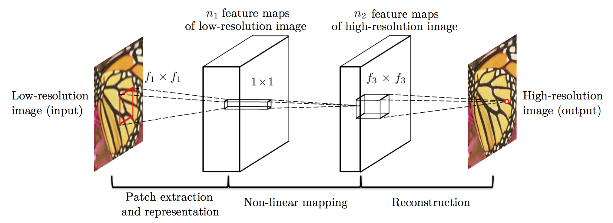

# Image-Super-Resolution

This is the implementation for Image-Superresolution

  

### Installation of libraries required
> sudo -H pip install -r requirement.txt

## Use:
*Before training we'll have to create data on which our machine will train.*
### Creating your own data
Open **prepare_data.py** and change the data path to your data.
 
***or***
 
Open folder name ***data*** clear folder and put your images.
  
> python prepare_data.py

### Training:
> python train.py

### Testing:
> python main.py
